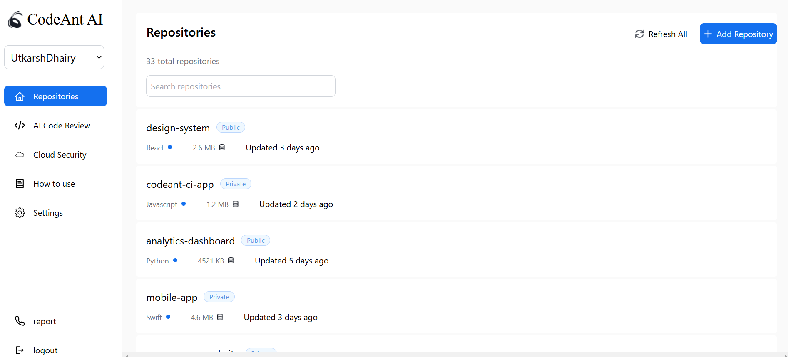

# 🚀 Frontend Developer Assignment

This repository contains a **frontend implementation** of the SignIn and Dashboard pages for CodeAnt AI's hiring assignment. The project demonstrates responsive design principles, reusable components, and clean coding practices using **React.js**, **TypeScript**, and **Material-UI**.

---

## 🌐 Live Demo

👉 Check out the live application: **[CodeAnt AI Demo](https://codeantai-ochre.vercel.app/)**  

---

## 📸 Screenshots

### 🔑 **SignIn Page**

  

### 📊 **Dashboard Page**

  

*(Replace the image paths with the actual paths to your screenshot files)*

---

## 🛠️ Run Locally

Clone the repository and follow these steps to run the application:

# Clone the repository
```bash
git clone https://github.com/yourusername/DoctorMy.git
cd CodeAi
```

# Navigate to the project directory
```bash
cd CoadAi
```

# Install dependencies
```bash
pnpm I
```


# Start the development server
```bash
pnpm run dev
```

## Features Overview

# # 🔐 SignIn Page
- Dual-section layout: Hero image on one side and SignIn options on the other.
- ToggleButton from Material-UI for selecting various authentication methods.
- Seamless navigation to the Dashboard upon sign-in.

# 🖥️ Dashboard Page
- Dynamic Navbar: Adjusts to a sidebar on desktops and a top navbar for mobile devices.
- Data Display: Fetches and presents repository data dynamically.
- Date Calculations: Uses date-fns to calculate repository update intervals.
- Enhanced UI: Features icons from react-icons for an intuitive and visually appealing design.
- Fully responsive layout tailored for all screen sizes.

# 🔍 Code Highlights
- Reusable Components: Built for scalability and maintainability.
- Strong Typing: Ensures type safety with TypeScript.
- Theming: Custom Material-UI themes implemented using createTheme.

# 🛡️ Tech Stack
Technology          Description
React.js (Vite)     Component-based UI library for performance
TypeScript          Static typing for safer code
Material-UI         Elegant UI components and theming
date-fns            Date utility library
react-icons         Comprehensive icon library for React

# Key Libraries & Tools
- React Router: For seamless navigation.
- Material-UI: Modern React UI framework.
- date-fns: For handling date/time functions.
- react-icons: Icon library for intuitive visuals.

# 💡 How it Works 
1. Users access the SignIn Page, which provides multiple authentication options.
2. Upon sign-in, users are redirected to the Dashboard Page.
3. The Dashboard dynamically fetches and displays data while ensuring a polished and responsive user experience.

# 🎨 Responsive Design in Action
Device      SignIn Page Layout                      Dashboard Layout
Desktop     Full hero image and SignIn options      Sidebar for navigation
            side-by-side

Tablet      Adjusted spacing for compact views      Navbar replaces sidebar

Mobile      Stack layout for optimized usability    Navbar remains accessible

# 📋 License
This project is open-source and free to use.

# 📧 Contact
If you have any questions or suggestions, feel free to reach out:

Email: ydvrahul5616@gmail.com
Portfolio: https://rahul-yadav-portfolio.vercel.app/
